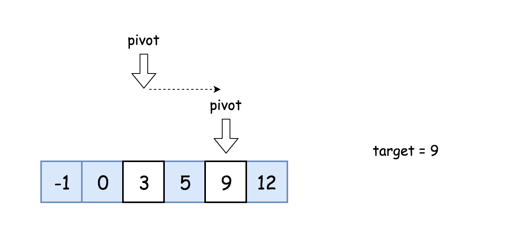

# 题目介绍：

## 二分查找方法解析：
二分查找是一种基于比较目标值和数组中间元素的教科书式算法。

* 如果目标值等于中间元素，则找到目标值。
* 如果目标值较小，继续在左侧搜索。
* 如果目标值较大，则继续在右侧搜索。


### 算法：

* 初始化指针 left = 0, right = n - 1。
* 当 left <= right：
    * 比较中间元素 nums[pivot] 和目标值 target 。
        * 如果 target = nums[pivot]，返回 pivot。
        * 如果 target < nums[pivot]，则在左侧继续搜索 right = pivot - 1。
        * 如果 target > nums[pivot]，则在右侧继续搜索 left = pivot + 1。


## 题目地址：https://leetcode-cn.com/problems/binary-search/

##### 给定一个 n 个元素有序的（升序）整型数组 nums 和一个目标值 target  ，写一个函数搜索 nums 中的 target，如果目标值存在返回下标，否则返回 -1。

####示例 1:
```text
输入: nums = [-1,0,3,5,9,12], target = 9
输出: 4
解释: 9 出现在 nums 中并且下标为 4
```

#### 示例 2:
```text
输入: nums = [-1,0,3,5,9,12], target = 2
输出: -1
解释: 2 不存在 nums 中因此返回 -1
```

#### 提示：
```text
你可以假设 nums 中的所有元素是不重复的。
n 将在 [1, 10000]之间。
nums 的每个元素都将在 [-9999, 9999]之间。
```


## 题目解答：

### 我的解答：
```java
class Solution {
    public int search(int[] nums, int target) {
         if (target< nums[0] || target> nums[nums.length -1]) {
            return -1;
        }
        int low=0, up= nums.length-1;
        int temIndex ;
        while (true) {
            temIndex = (low+up)/2;
            if (temIndex == low &&target != nums[temIndex] && target != nums[up]) {
                return -1;
            } else if (target == nums[up]) {
                return up;
            }
            else if (target == nums[temIndex]) {
                return temIndex;
            } else if(target< nums[temIndex]) {
                up = temIndex;
            } else {
                low = temIndex;
            }

        }
    }
}
```
### 官方解答
```java
class Solution {
  public int search(int[] nums, int target) {
    int pivot, left = 0, right = nums.length - 1;
    while (left <= right) {
      pivot = left + (right - left) / 2;
      if (nums[pivot] == target) return pivot;
      if (target < nums[pivot]) right = pivot - 1;
      else left = pivot + 1;
    }
    return -1;
  }
}
```


